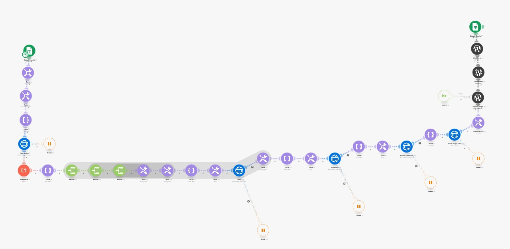

# VBliss_Blog

This project contains source code and supporting files for a serverless application that replaces a Make.com scenario [JSON Export of the Scenario](blueprint.json):

It runs on a pre-defined schedule (note that the schedule is disabled by default to avoid incurring charges). It demonstrates the power of Step Functions to orchestrate Lambda functions and other AWS resources to form complex and robust workflows, coupled with event-driven development using Amazon EventBridge.

AWS Step Functions lets you coordinate multiple AWS services into serverless workflows so you can build and update apps quickly. Using Step Functions, you can design and run workflows that stitch together services, such as AWS Lambda, AWS Fargate, and Amazon SageMaker, into feature-rich applications.
