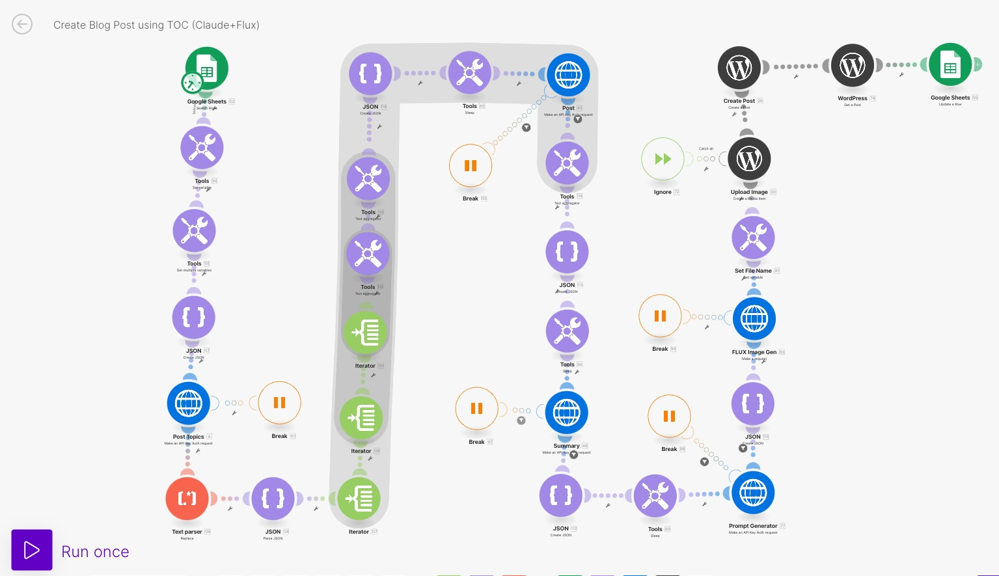
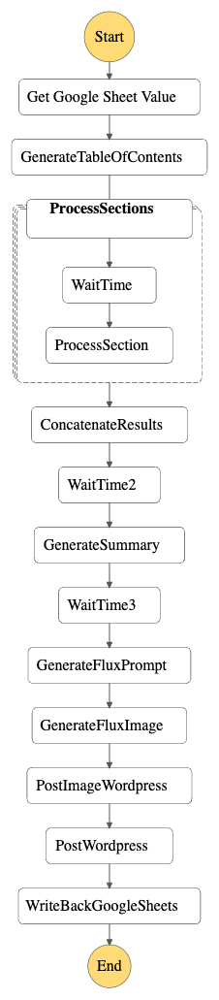

# VBliss_Blog

## Make.Com Scenario: VBliss Blog -> AWS Serverless Step Functions

This project contains source code and supporting files for a serverless application that replaces a [Make.com](make.com) scenario [JSON Export of the Scenario](blueprint.json):



The scenario works as follows:

0. It assumes I have a Google Sheet prefilled with blog post titles (I used a different scenario to fill this sheet with titles)
1. It logs into Google Sheets and retrieves the first blog title that has not been posted
2. Then it creates a table of contents in JSON using Claude Opus (I was already using AWS Bedrock API for this)
3. It separates the table of contents by top level items
4. It generates the blog post section for each of the top level items
5. It concatenates all the blog post sections into a single large blog post
6. It then generates a summary of the whole blog post
7. It creates a prompt for a Stable Difussion model to generate an image for the blog post
8. It uses the prompt generated to create a Stable Difussion image
9. It uploads the image to Wordpress
10. Uploads the blog post into Wordpress
11. Updates Google Sheets with the blog post information such as post url, image url, excerpt and time of post

## The state machine created



It runs on a pre-defined schedule (note that the schedule is disabled by default to avoid incurring charges).

File template.yaml:

```python
      Events:
        BlogPostingSchedule:
          Type: Schedule 
          Properties:
            Description: Schedule to write the blog post every hour
            Enabled: False # This schedule is disabled by default to avoid incurring charges.
            Schedule: "rate(1 hour)"
```

AWS Step Functions lets you coordinate multiple AWS services into serverless workflows so you can build and update apps quickly. Using Step Functions, you can design and run workflows that stitch together services, such as AWS Lambda, AWS Fargate, and Amazon SageMaker, into feature-rich applications.

I will monitor the cost of this AWS solution and report back to see if this actually was less expensive than running in Make.com.
