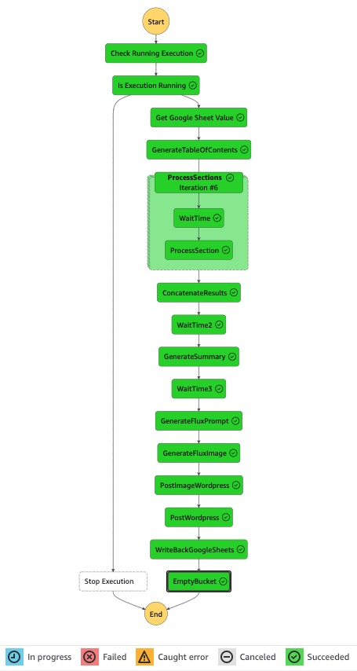

# VBliss_Blog

An AWS Serverless Step Functions implementation of an automated blog posting workflow for [VBliss](https://vbliss.com.mx).

## Overview

This project replaces a [Make.com](https://www.make.com) scenario with an AWS Serverless application using Step Functions. It automates the process of creating and posting blog content, including:

- Generating text with AI
- Creating images
- Updating WordPress

This serves as a proof of concept to migrate the blog posting workflow from a cloud-based no-code platform to AWS. For the main project repository, see [here](../README.md).

## Original Make.com Scenario


[View JSON Export of the Scenario](blueprint.json)

## VBliss Blog Post Generation State Machine

This AWS Step Functions State Machine automates the process of generating and publishing blog posts for VBliss.



### Workflow Overview

1. **Content Generation**
   - Retrieve metadata from Google Sheets
   - Generate a table of contents
   - Process individual sections of the blog post
   - Concatenate processed sections into a full blog post

2. **Summary and Image Generation**
   - Generate a summary of the blog post
   - Create a prompt for image generation
   - Generate an image using Stability Diffusion

3. **WordPress Publishing**
   - Upload the generated image to WordPress
   - Publish the complete blog post with the image

4. **Finalization**
   - Update Google Sheets with the results
   - Clean up temporary resources

### Key Components

- **Google Sheets Integration**: Read and write data to maintain blog post information
- **Content Generation**: Use AI-powered Lambda functions to create blog post content
- **Image Generation**: Utilize Stability AI models in Bedrock for creating relevant images
- **WordPress Integration**: Automatically publish posts and images to WordPress
- **Error Handling**: Implement retry mechanisms for resilience
- **Concurrency Control**: Manage parallel processing of blog post sections

### State Machine Structure

The state machine comprises multiple states, each responsible for a specific task in the blog post creation and publishing process. Key states include:

- Get Google Sheet Value
- GenerateTableOfContents
- ProcessSections
- GenerateSummary
- GenerateFluxPrompt
- GenerateFluxImage
- PostImageWordpress
- PostWordpress
- WriteBackGoogleSheets
- EmptyBucket

## Technologies Used

- AWS Step Functions
- AWS Lambda
- AWS Bedrock (Claude Opus)
- Stable Diffusion
- WordPress
- Google Sheets API

## Prerequisites

- AWS account with appropriate permissions
- Configured Lambda functions for each task
- Google Sheets API access
- WordPress site with API access
- HuggingFace Flux.dev API credentials

## Deployment

The application is deployed as an AWS Serverless application using CloudFormation.

### Scheduling

The `template.yaml` file contains the following event configuration:

```yaml
Events:
  BlogPostingSchedule:
    Type: Schedule 
    Properties:
      Description: Schedule to write the blog post every hour
      Enabled: False # Disabled by default to avoid incurring charges
      Schedule: "rate(1 hour)"
```

To enable the schedule, set `Enabled: True` and redeploy the stack.

## Getting Started

1. Clone this repository
2. Install the AWS SAM CLI
3. Deploy the application using `sam deploy --guided`
4. Configure the necessary API keys and credentials for external services in AWS Secrets Manager

## Customization

To customize this state machine for your specific needs, you may need to modify:

- Lambda functions and other AWS resources
- Create your own secrets in Secrets Manager to keep your API keys safe
- Google Sheets integration details
- WordPress configuration
- Flux image generation parameters

## Cost Analysis

We will monitor and compare the costs of this AWS solution against the original Make.com scenario. Results will be updated here when available.

## Contributing

Contributions are welcome! Please open an issue or submit a pull request with any improvements.

## License

This project is licensed under the [GNU GENERAL PUBLIC LICENSE](../LICENSE)